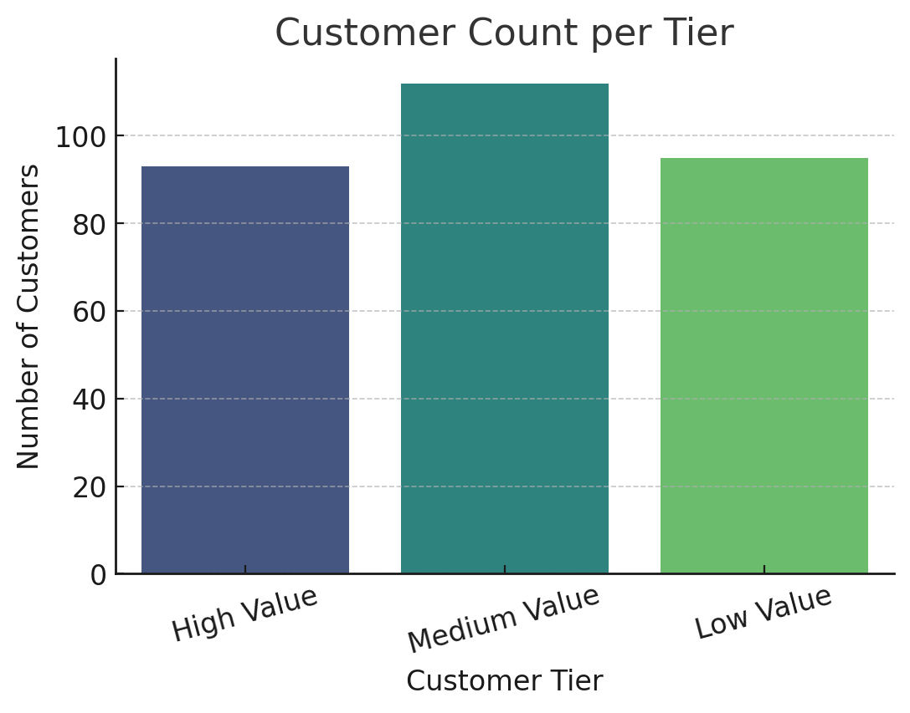
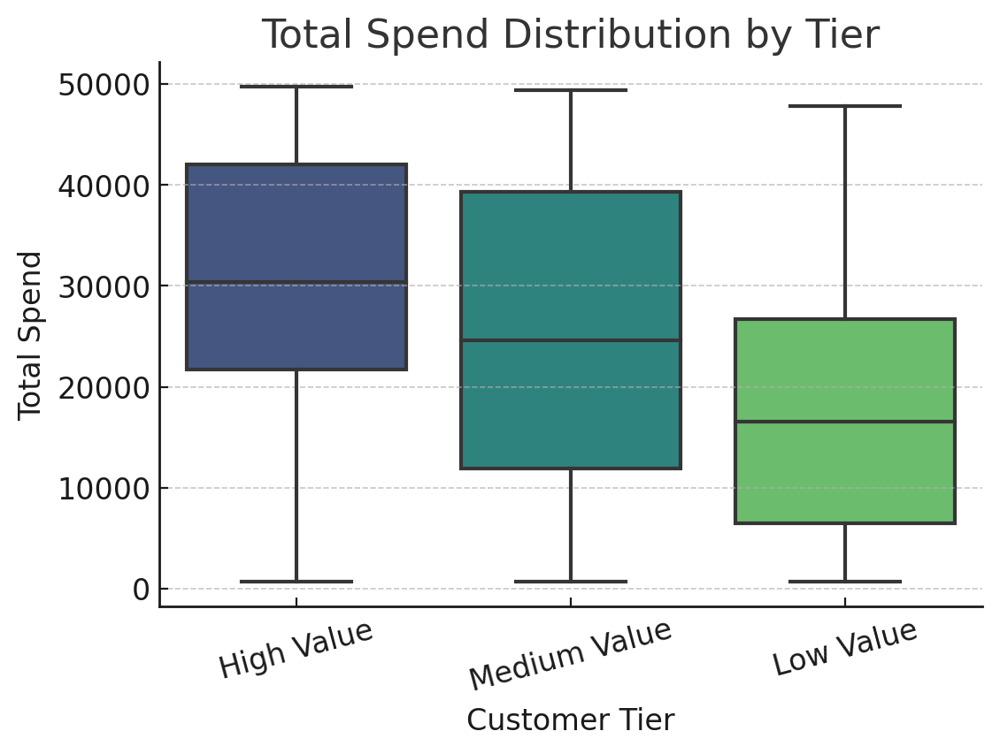
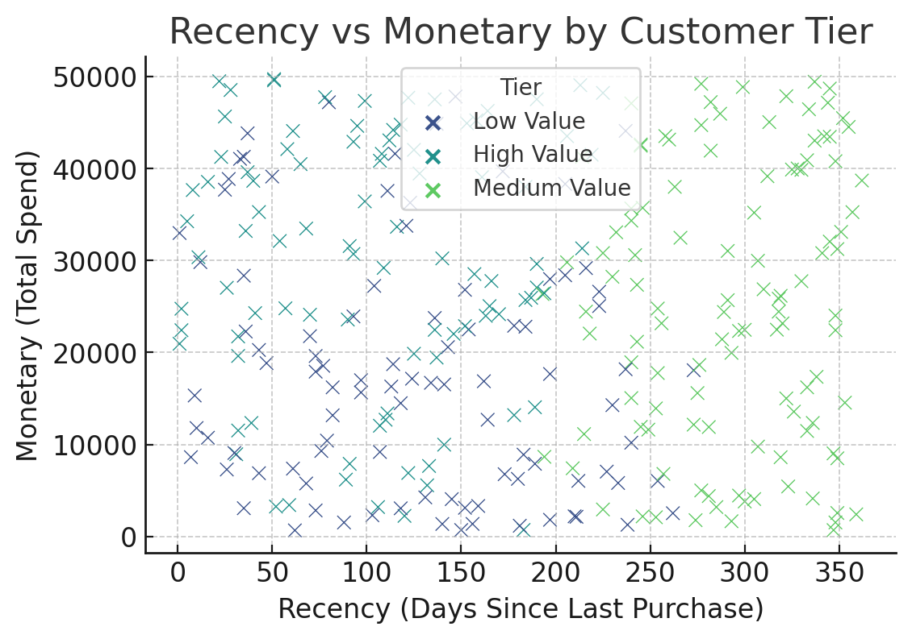

# 🛍️ Customer Segmentation – Python

## 📌 Project Overview
This project segments e-commerce customers into **High**, **Medium**, and **Low** value tiers based on purchasing behavior.  
Segmentation helps businesses target marketing campaigns more effectively, retain high-value customers, and increase revenue from medium/low value segments.

🔗 **[View Live Dashboard](https://github.com/singh-chandrakant/Customer_Segmentation)** 

## 🎯 Objectives
- Clean raw customer data
- Create RFM (Recency, Frequency, Monetary) features
- Apply **KMeans clustering** for segmentation
- Visualize results using Matplotlib & Seaborn

---

---

## 🗂 Dataset Information
**Source:** Synthetic e-commerce customer dataset  
**Columns:**
- `CustomerID` – Unique customer identifier  
- `TotalSpend` – Total revenue from the customer  
- `TotalOrders` – Number of purchases made  
- `AvgOrderValue` – Average order size  
- `LastPurchaseDate` – Date of last purchase  

---

## ⚙️ Steps & Methodology
1. **Data Cleaning**
   - Removed duplicates  
   - Handled missing values  
2. **Feature Engineering**
   - `Recency`: Days since last purchase  
   - `Frequency`: Number of orders  
   - `Monetary`: Total spend  
3. **Data Scaling**
   - Standardized RFM values using `StandardScaler`  
4. **Clustering**
   - Applied `KMeans` with 3 clusters  
   - Assigned **High**, **Medium**, **Low** value tiers  
5. **Visualization**
   - Tier distribution bar chart  
   - Spend distribution boxplot  
   - Recency vs Monetary scatter plot  

---

## 📊 Visualizations
### 1️⃣ Tier Distribution


### 2️⃣ Spend Distribution by Tier


### 3️⃣ Recency vs Monetary


---

## 💡 Insights
- **High Value Customers**: Highest spend, lowest recency — ideal for retention programs.  
- **Medium Value Customers**: Moderate spend — can be targeted for upselling.  
- **Low Value Customers**: Low spend, high recency — require re-engagement strategies.  

---
**Author:**    Chandrakant Singh                                                            
         📧 singhchandrakant321@gmail.com                                                        
         📍 Bengaluru, Karnataka, India

## 🚀 How to Run
```bash
# 1. Install dependencies
pip install pandas numpy matplotlib seaborn scikit-learn

# 2. Run the segmentation script
python segmentation_script.py


